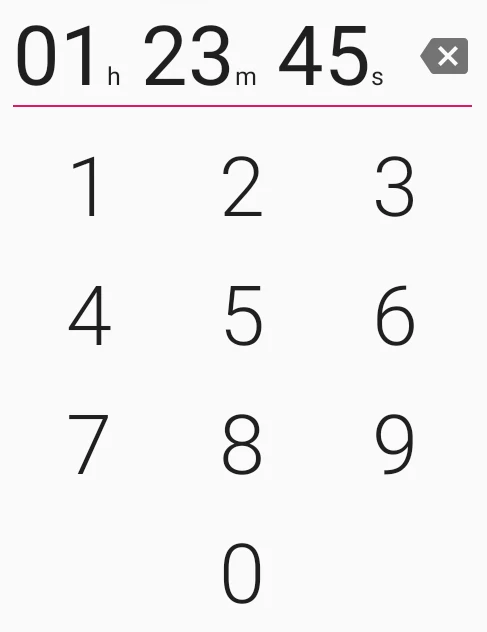

# HmsPickerView

A beautiful little Android view to pick hours, minutes, seconds.



## Installation

TODO

## Usage

```XML
<xyz.aprildown.hmspickerview.HmsPickerView
    android:id="@+id/hmsPickerView"
    android:layout_width="match_parent"
    android:layout_height="wrap_content"
    android:layout_gravity="center" />
```

## License

[LICENSE](./LICENSE)