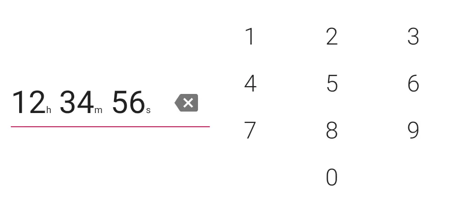

[](https://jitpack.io/#xyz.aprildown/HmsPickerView)
[]( https://android-arsenal.com/details/1/7644 )

# HmsPickerView

A beautiful little Android view to pick hours, minutes and seconds.




## Installation

Step 1. Add it in your root build.gradle at the end of repositories:

```Groovy
allprojects {
    repositories {
        ...
        maven { url 'https://jitpack.io' }
    }
}
```

Step 2. Add the dependency

```Groovy
dependencies {
    implementation "xyz.aprildown:HmsPickerView:${version}"
}
```

[](https://jitpack.io/#xyz.aprildown/HmsPickerView)

## Usage

In the XML:

```XML
<xyz.aprildown.hmspickerview.HmsPickerView
    android:id="@+id/hmsPickerView"
    android:layout_width="wrap_content"
    android:layout_height="wrap_content" />
```

```XML
<attr name="hpv_time_text_size" format="dimension" />
<!--default: 44sp port, 32sp land-->
<attr name="hpv_digit_text_size" format="dimension" />
<!--default: 40sp port, 24sp land-->
```

In the code:

```Kotlin
fun getHours(): Int
fun setHours(hours: Int)

fun getMinutes(): Int
fun setMinutes(minutes: Int)

fun getSeconds(): Int
fun setSeconds(seconds: Int)

fun getTimeInMillis(): Long
fun setTimeInMillis(time: Long)

fun setTimeTextSize(@Px textSize: Int)
fun setDigitTextSize(@Px textSize: Int)

fun setListener(l: HmsPickerView.Listener)
interface Listener {
    /**
     * Indicates [HmsPickerView] now has an valid input(anything except 00h 00m 00s).
     * This methods can be used to allow user to go forward (such as enabling "next" button).
     */
    fun onHmsPickerViewHasValidInput(hmsPickerView: HmsPickerView)

    /**
     * Indicates [HmsPickerView]'s input becomes 00h 00m 00s.
     * This methods can be used to prevent user from going forward(such as disabling "next" button).
     */
    fun onHmsPickerViewHasNoInput(hmsPickerView: HmsPickerView)
}
```

### Use this view in a dialog

1. Create a XML file like [this one](https://github.com/DeweyReed/HmsPickerView/blob/master/app/src/main/res/layout/layout_picker.xml#L1).
1. Wrap it into an AlertDialog like [this one](https://github.com/DeweyReed/HmsPickerView/blob/master/app/src/main/java/xyz/aprildown/hmspickerview/app/MainActivity.kt#L29).

**🦄 Please star this repo if you like it 🦄**

## License

[LICENSE](./LICENSE)
